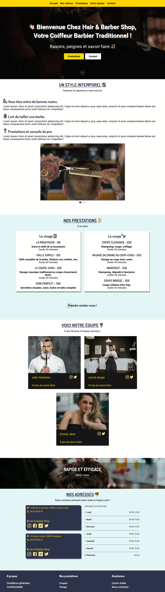

## 💇 HAIR & BARBER SHOP 💈

## Le challenge

Création d'un site complet Hair & barber shop en HTML5, CSS3 et JavaScript. Ce site présente notamment les différents services proposés par ce commerçant et les personnes qui y travaillent. Vous trouverez également les adresses de l'établissement, les horaires ainsi que les commentaires laissés par des clients.

## Démonstration

Lien vers le projet : https://aperbet56.github.io/hair_and_barber_shop/

## Projet développé avec

- Utilisation des balises sémantiques HTML5
- CSS3
- Flexbox
- Utilisation d'un normaliseur : le fichier normalize.css
- Importation des polices "Dosis" et "Roboto"
- Animations CSS (transition, @keyframes)
- Utilisation du cubic-bezier
- Création de bouton marquee
- Utilisation de pseudo-élément
- Page web responsive
- Desktop first
- JavaScript
- Code JavaScript commenté
